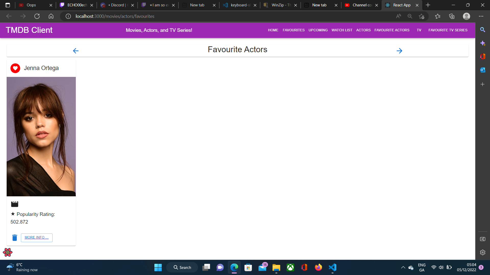
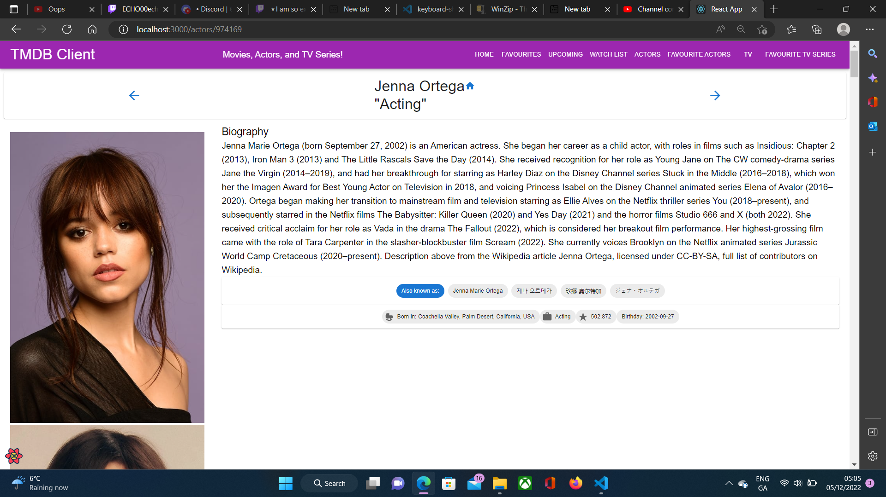
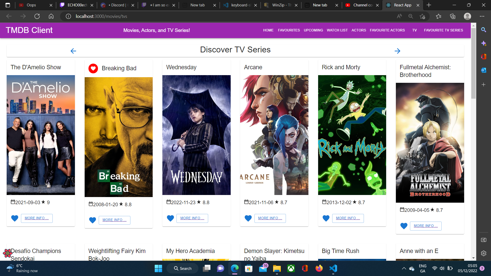
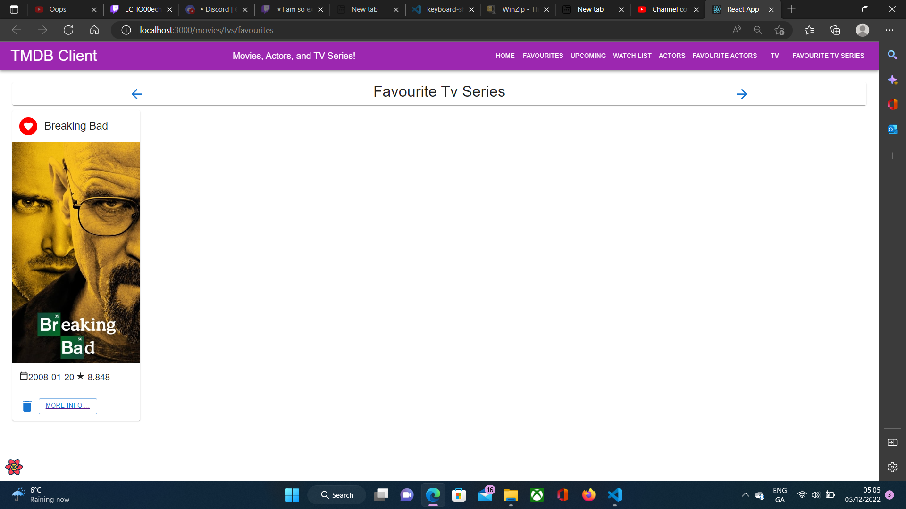
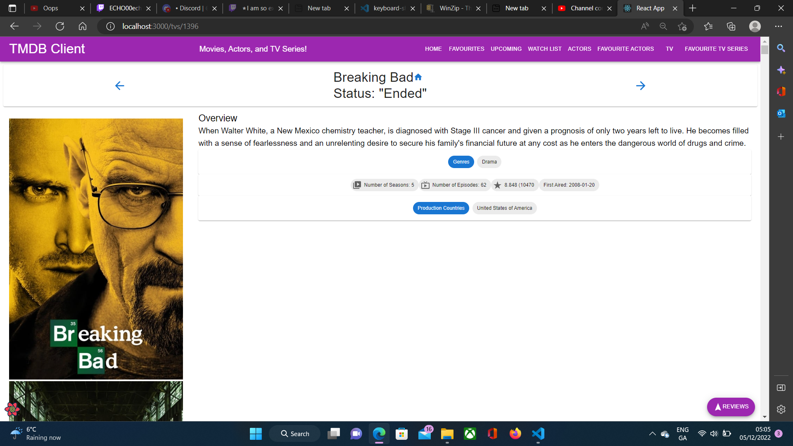
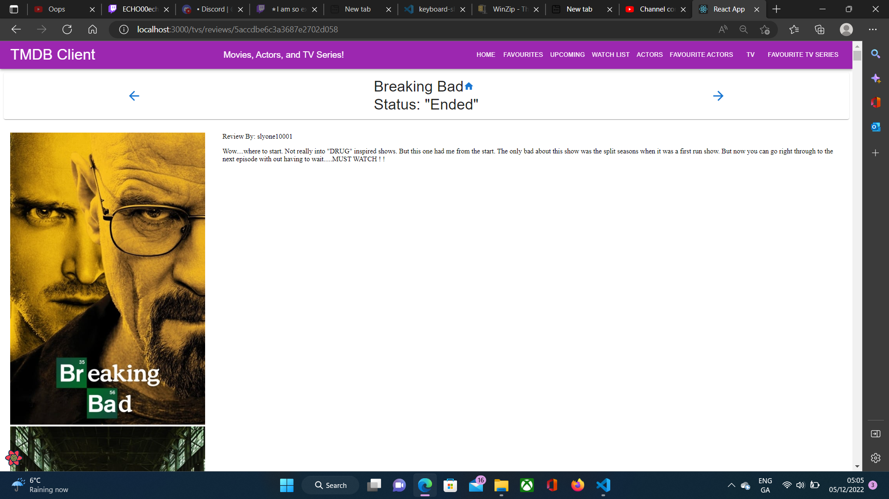

# Web App Dev 2 - Assignment 1 - ReactJS app.

Name: Georgina Walsh.

## Overview.

### New Pages.

+ List of Popular Actors.
+ Actor Details.
+ Favourite Actors.
+ List of Top Rated Tv Series.
+ Tv Series details.
+ Favourite Tv Series.
+ Tv Series Reviews.

### New Features.

+ View popular actors. 
+ Add actors to a favourites list. Clicking on the "More info" button of the actor's card will bring you to a new page containing some of the actor's details.
+ View Top Rated Tv Series. 
+ Add tv seiries to a favourites list. Clicking on the "More info" button of the show's card will bring you to a new page containing some of the show's details.
+ Tv Details also has a "reviews" button, where you can see some reviews IMDB user's made about the show. There is a link for each review which brings you to a new page so you may read the entire review.

## Setup requirements.
-----

## TMDB endpoints.

+ /movies/actors - A list of popular actors.
+ /movies/actors/favourites - A personalised list of actors the user favourited.
+ /movies/tvs - A list of top rated tv series.
+ /movies/tvs/favourites - A personalised list of tv series the user favourited. 
+ /actors/{actor_id) - The datails of an actor.
+ /tvs/{tv_id} - The datails of a tv series.
+ /tvs/reviews/{tv_review_id} - Provides the entire review a IMDB user made.

## App Design.

### Component catalogue.
-----

### UI Design.

>Shows a list of popular actors.

>Shows a list of favourited actors.

>Provides information about a selected actor.

>Shows a list of top rated tv shows.

>Shows a list of favourited tv shows.

>Provides information about a selected tv show.

>Provides the entire selected review for a tv series.

### Routing.

+ /movies/actors - displays a list of popular actors.
+ /movies/actors/favourites - shows the actors the actors the user favourited.
+ /movies/tvs - displays a list of top rated tv series.
+ /movies/tvs/favourites - shows the tv series the user favourited. 
+ /actors/{actor_id) - displays an actor's details.
+ /tvs/{tv_id} - displays a tv series' details.
+ /tvs/reviews/{tv_review_id} - shows an IMDB user review.

## Independent learning (If relevant).
-------
